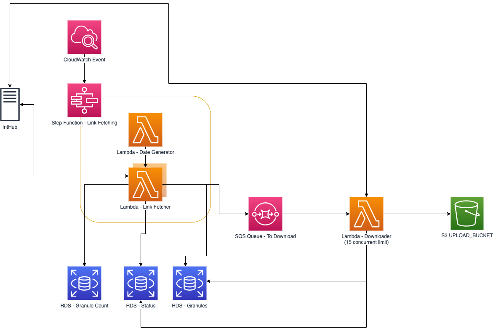

# HLS Sentinel 2 Downloader Serverless 🛰

This project aims to provide a serverless implementation of the current [HLS S2 Downloader](https://github.com/NASA-IMPACT/hls-sentinel2-downloader/tree/version2-ajinkya). The following diagram indicates a high level design for the proposed architecture:



# Contents

* [🧑‍💻 Development - Requirements](#requirements)
* [🧑‍💻 Development - Getting started 🏃‍♀️](#getting-started-🏃‍♀️)
* [🧑‍💻 Development - Repository TL;DR:](#repository-tldr)
* [🧑‍💻 Development - Lambda and Layer development TL;DR:](#lambda-and-layer-development-tldr)
* [🧑‍💻 Development - Makefile goodness](#makefile-goodness)
* [🚀 Deployment - Prerequisites](#prerequisites)
* [🚀 Deployment - Standard Deployments](#standard-deployments)
* [🚀 Deployment - Testing Deployments](#testing-deployments)

# Development

## Requirements

To develop on this project, you should install:

* NVM [Node Version Manager](https://github.com/nvm-sh/nvm) / Node 12
* [AWS CDK](https://docs.aws.amazon.com/cdk/latest/guide/getting_started.html) - There is a `package.json` in the repository, it's recommended to run `npm install` in the repository root and make use of `npx <command>` rather than globally installing AWS CDK
* [pyenv](https://github.com/pyenv/pyenv) / Python 3.8.6
* [pipenv](https://github.com/pypa/pipenv)
* [AWS CLI](https://docs.aws.amazon.com/cli/latest/userguide/cli-chap-welcome.html)
* [OpenSSL](https://github.com/openssl/openssl) (For Postgres/DB work)

If you're developing on MacOS, all of the above (apart from AWS CDK) can be installed using [homebrew](https://brew.sh/)

## Getting started 🏃‍♀️

To get setup for overall development, ensure you've installed all the above [requirements](#Requirements), run the following commands in the root of the repository and you'll be good to go!

```bash
$ nvm install # This sets up your node environment
$ npm install # This installs any node packages that are within package.json (CDK etc.)
$ make install # This calls `pipenv install --dev` on the repo root and any of the directories that contain a Makefile with `install`
```

_**Note** you might have an issue installing `psycopg2` - I found [this](https://github.com/pypa/pipenv/issues/3991#issuecomment-564645309) helpful_

A file named `.env` is expected in the root of the repository, the expected values are:

```bash
OWNER="<your name>"
IDENTIFIER="<a unique value to tie to your cdk deployment>"
AWS_DEFAULT_REGION="<the AWS region you're deploying to>"
AWS_DEFAULT_PROFILE="<your named AWS CLI profile to use for deployment>"
PIPENV_NO_INHERIT=TRUE # This is used to ensure our Lambdas/Layers get separate Pipenv environments
ENABLE_DOWNLOADING="TRUE" # Or "FALSE" - If TRUE then the TO_UPLOAD queue is set as an enabled source to the Downloader
SCHEDULE_LINK_FETCHING="TRUE" # Or "FALSE" - If TRUE then link fetching will happen every day at midday.
USE_INTHUB2="TRUE" # Or "FALSE" - If TRUE then the Downloader will use IntHub2 credentials when downloading
REMOVAL_POLICY_DESTROY="TRUE" # Or "FALSE" - See below for what is deleted if TRUE
UPLOAD_BUCKET="<name-of-aws-s3-bucket-to-upload-images-to>"
```

An example that you can modify and rename to `.env` is provided: `example.env`

## Using `REMOVAL_POLICY_DESTROY`

When `REMOVAL_POLICY_DESTROY` is set to `TRUE`, resources such as `LogGroup`s and the `RDS` cluster will `DESTROY` rather than `RETAIN` when the Stack is destroyed

## Repository TL;DR:

This project has 5 main directories in which you'll find the majority of code needed for `hls-sentinel2-downloader-serverless`:

```
├── alembic_migration # Specific Alembic code for database migration - Includes code for bootstrapping a DB with CDK
├── cdk # AWS CDK code for deploying both the downloader stack and integration test stacks
├── integration_tests # Pytest integration tests
├── lambdas # Directory of Lambdas and their associated code
└── layers # Directory of Layers (common code modules used across our Lambdas)
```

The pattern for this monorepo approach was devised amongst a few folks at Development Seed, you can read up on this pattern and how it fits together [here at the example repository](https://github.com/alukach/cdk-python-lambda-monorepo).

Most directories will contain a README to explain what the purpose is of the component and how to develop it.

## Lambda and Layer development TL;DR:

Every Lambda and Layer directory has a `Makefile` inside, this contains a subset of the commands found in the [root repository Makefile](#makefile-goodness). Each `Makefile` should come with `install`, `lint`, `format`, and `test` as standard, these are then added as calls in the root Makefile so that we can install/lint/format/unit test all our code at a project level.

Per-Lambda/Layer development is recommended to be done by opening the specific components directory in a new IDE window (this just makes life easier for IDE prompts etc as the directory has its own `Pipenv` virtual environment). To get started, go into the directory of the Lambda/Layer and run:

```
$ make install # Creates a Pipenv env for the directory and installs the dependencies
```

For further guides on how to make new Lambdas/Layers, follow the examples in [the example monorepo repo](https://github.com/alukach/cdk-python-lambda-monorepo).

## Makefile goodness

A `Makefile` is available in the root of the repository to abstract away commonly used commands for development:

**`make install`**

> This will run `pipenv install --dev` on the repo root and the directories that contain `pipenv` projects

**`make lint`**

> This will perform a dry run of `flake8`, `isort`, and `black` and let you know what issues were found

**`make format`**

> This will peform a run of `isort` and `black`, this **will** modify files if issues were found

**`make diff`**

> This will run a `cdk diff` using the contents of your `.env` file

**`make deploy`**

> This will run a `cdk deploy` using the contents of your `.env` file. The deployment is auto-approved, so **make sure** you know what you're changing with your deployment first! (Best to run `make diff` to check!)

**`make destroy`**

> This will run a `cdk destroy` using the contents of your `.env` file. The destroy is auto-approved, so **make sure** you know what you're destroying first!

**`make diff-integration`**

> This will run a `cdk diff` using the contents of your `.env` file on the integration test stack

**`make deploy-integration`**

> This will run a `cdk deploy` using the contents of your `.env` file on the integration test stack. The deployment is auto-approved, so **make sure** you know what you're changing with your deployment first! (Best to run `make diff` to check!)

**`make destroy-integration`**

> This will run a `cdk destroy` using the contents of your `.env` file on the integration test stack. The destroy is auto-approved, so **make sure** you know what you're destroying first!

**`make unit-tests`**

> This will run the unit tests within the project with `pytest`

**`make integration-tests`**

> This will run the integration tests within the project with `pytest` **You need to have run `make deploy-integration` first, otherwise these will fail straight away**

# Deployment

## Prerequisites

Firstly, ensure you've installed all the project requirements as described [here](#requirements) and [here](#getting-started-🏃‍♀️).

### SciHub Credentials

The deployment relies on the SciHub Credentials having been added to the AWS account previously within Secrets Manager. For your given `IDENTIFIER` value, the Secret should be stored under `hls-s2-downloader-serverless/<IDENTIFIER>/scihub-credentials`.

This is **required** in standard deployments, for integration deployments, a secret (containing junk) is created for you.

The Secret should look like:

```json
{
  "username": "<username>",
  "password": "<password>"
}
```

### IntHub2 Credentials

The deployment relies on the IntHub2 Credentials having been added to the AWS account previously within Secrets Manager. For your given `IDENTIFIER` value, the Secret should be stored under `hls-s2-downloader-serverless/<IDENTIFIER>/inthub2-credentials`.

This is **required** in standard deployments where `USE_INTHUB2` is set to `TRUE`, it is not used within integration deployments.

The Secret should look like:

```json
{
  "username": "<username>",
  "password": "<password>"
}
```

### Upload Bucket

The deployment relies on an S3 Bucket being available to upload images to. The Bucket Name should be available within your `.env` file under `UPLOAD_BUCKET`.

This is **required** in standard deployments, for integration deployments, a bucket is created and setup for you.

You must allow the `downloader` function `read` and `write` permissions to your bucket, you can find the ARN of the `downloader` functions execution role in
SSM Parameter Store [here](https://us-west-2.console.aws.amazon.com/systems-manager/parameters/) under the name `integration_tests/<IDENTIFIER>/downloader_role_arn`. Use this within the Buckets permissions to allow access.

Your Bucket Policy will look like:

```json
{
    "Version": "2012-10-17",
    "Statement": [
        {
            "Effect": "Allow",
            "Principal": {
                "AWS": "<downloader-role-arn>"
            },
            "Action": [
                "s3:PutObject*",
                "s3:Abort*"
            ],
            "Resource": [
                "arn:aws:s3:::<bucket-name>/*",
            ]
        }
    ]
}
```

## Standard Deployments

For standard deploys, you can check _what_ you'll be deploying by running:

```bash
$ make diff # Outputs the CDK Diff
```

To deploy the infrastructure, you can run:

```bash
$ make deploy # Deploys DownloaderStack
```

To destroy the infrastructure, you can run:

```bash
$ make destroy # Destroys DownloaderStack
```

## Testing Deployments

Because in a real world deployment we rely on 3rd party APIs, we've provided a `IntegrationStack` to deploy infrastructure that mimics these 3rd party APIs, reducing our reliance on them being available for testing.

For a testing deployment, you can check _what_ you'll be deploying by running:

```bash
$ make diff-integration # Outputs the CDK Diff
```

To deploy the infrastructure, you can run:

```bash
$ make deploy-integration # Deploys DownloaderStack and IntegrationStack
```

To destroy the infrastructure, you can run:

```bash
$ make destroy-integration # Destroys DownloaderStack and IntegrationStack
```
