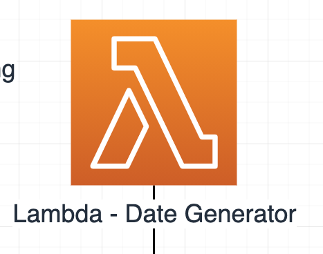

# Date Generator 📆

## High level overview



The Date Generators purpose is to generate a list of strings in the form `YYYY-MM-DD` for 21 days from `today - 1` into the past. It is invoked within the `Link Fetching` Step Function.

---

## Handler breakdown

Provided below is some pseudo-code to explain the process happening each time the lambda is invoked:

```python
yesterdays_date = get_yesterdays_date()
return generate_list_of_21_dates_into_the_past_from(yesterdays_date)
```

---

## Development

This Lambda makes use of `pipenv` for managing depedencies and for building the function when deploying it.

To get setup for developing this project, run:

```bash
$ pipenv install --dev
```

_**Note** if you don't have `PIPENV_NO_INHERIT=TRUE` in your env vars, you will need to prepend the above command with it, to make sure you create a `pipenv` `venv` for just this directory._

---

### Makefile

A `Makefile` is provided to abstract commonly used commands away:

**`make install`**

> This will run `pipenv install --dev` to install development dependencies

**`make lint`**

> This will perform a dry run of `flake8`, `isort`, and `black` and let you know what issues were found

**`make format`**

> This will peform a run of `isort` and `black`, this **will** modify files if issues were found

**`make test`**

> This will run the unit tests of the project with `pytest` using the contents of your `.env` file

---

