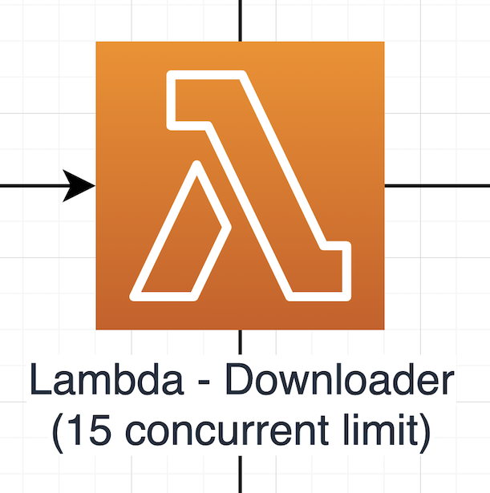

# Downloader 💾

## High level overview



The Downloaders purpose is download Sentinel 2 Images from Sci/IntHub. It is invoked via SQS messages being available within the `TO_DOWNLOAD` SQS queue; this handler will be limited to a concurrency limit of 15, due to the nature of the dedicated connection we have to IntHub. Images downloaded are stored on the mounted EFS volume under the path of `efs_volume_mount/<image_id>/<image_filename>`. Interactions with the `granule` table include marking the download as having started, updating the checksum of the image, and marking that the download is complete.

---

## Handler breakdown

Provided below is some pseudo-code to explain the process happening each time the lambda is invoked:

```python
message_contents = get_message_contents()

try:
    granule = get_granule_for_message_and_set_to_downloading()
except NotFound:
    return
except FailedToSetToDownloading:
    raise

if granule.downloaded
    return

if granule.retries is over limit:
    raise

try:
    checksum = get_checksum_from_scihub()
except FailedToGetChecksum:
    raise

try:
    if already_downloaded():
        if checksums_match():
            set_to_downloaded()
            add_to_upload_queue()
        else:
            remove_file()
            increase_retry()
            re_add_message_to_download_queue()
        return
    else:
        download_file()
        if checksums_match():
            set_to_downloaded()
            add_to_upload_queue()
        else:
            remove_file()
            increase_retry()
            re_add_message_to_download_queue()
        return
except FailedToHandleValidFile:
    raise
except FailedToHandleInvalidFile:
    raise
except FailedToDownloadFile:
    raise
```

### Notes:

Due to the nature of how Lambda is invoked by SQS, a non-failed invocation of a Lambda will result in the SQS message being deleted. Because of this, if we need to gracefully handle an error, we tidy up, then **re-add the failed message back to the `TO_DOWNLOAD` queue**. As this is a caught, handled exception, we can then gracefully exit the lambda with a `return` statement, there is no need to raise an alert.

For errors which we cannot recover easily from within the handler, **we `raise` an exception**. This will result in SQS keeping the message, hiding it during its visibility timeout, then making the message available to be consumed again.

---

## Development

This Lambda makes use of `pipenv` for managing depedencies and for building the function when deploying it.

To get setup for developing this project, run:

```bash
$ pipenv install --dev
```

_**Note** if you don't have `PIPENV_NO_INHERIT=TRUE` in your env vars, you will need to prepend the above command with it, to make sure you create a `pipenv` `venv` for just this directory._

This Lambda makes use of the `db` module that will be available via a Lambda Layer once deployed. For local development purposes, it is installed as a editable relative `[dev-packages]` dependency

---

### .env

This Lambda requires a `.env` file in its directory containing the following env vars:

```
PG_PASSWORD="<any-value>"
PG_USER="<any-value>"
PG_DB="<any-value>"
```

This is used whilst running the tests to provide both the Postgres container and the test code the credentials needed to access the database created.

---

### Makefile

A `Makefile` is provided to abstract commonly used commands away:

**`make lint`**

> This will perform a dry run of `flake8`, `isort`, and `black` and let you know what issues were found

**`make format`**

> This will peform a run of `isort` and `black`, this **will** modify files if issues were found

**`make test`**

> This will run the unit tests of the project with `pytest` using the contents of your `.env` file

---

