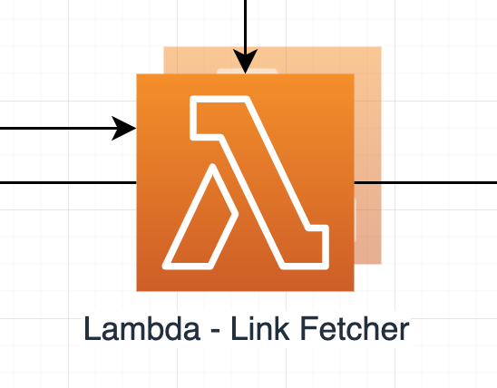

# Link Fetcher 🔗

## High level overview



The Link Fetchers purpose is to query IntHub/SciHub for new imagery links to download. It is invoked via a CloudWatch Event at a interval; every run it will query for the past 21 days worth of images. Images to download are stored as records in the `granule` table, the `granule_count` table is also updated with available and fetched link counts. The 'To Download' queue is also populated with the images IDs and download URLs.

---

## Handler breakdown

Provided below is some pseudo-code to explain the process happening each time the lambda is invoked:

```python
for day in last_21_days:
    available, processed = get_how_many_links_are_available_and_have_been_processed()
    query = generate_the_query_for_inthub_for_a_day(day)

    while there_is_still_imagery_to_process:

        results, total_results = get_a_page_of_query_results(query)
        update_total_results_in_granule_count(total_results)

        if not results:
            there_is_still_imagery_to_process = False
            break

        increase_query_start_point_by_number_of_results(results)

        filtered_results = filter_results_for_only_tiles_we_want(results)

        add_results_to_db(filtered_results)
        add_results_to_download_queue(filtered_results)

        update_db_statuses()
```

---

## Development

Per-Lambda development is recommended to be done by opening the specific Lambdas directory in a new IDE window (this just makes life easier for IDE prompts etc as the directory has its own `pipenv` virtual environment).

---

### Pipenv

This Lambda makes use of `pipenv` for managing depedencies and for building the function when deploying it.

To get setup for developing this project, run:

```bash
$ pipenv install --dev
```

_**Note** if you don't have `PIPENV_NO_INHERIT=TRUE` in your env vars, you will need to prepend the above command with it, to make sure you create a `pipenv` `venv` for just this directory._

This Lambda makes use of the `db` module that will be available via a Lambda Layer once deployed. For local development purposes, it is installed as a editable relative `[dev-packages]` dependency

---

### .env

This Lambda requires a `.env` file in its directory containing the following env vars:

```
PG_PASSWORD="<any-value>"
PG_USER="<any-value>"
PG_DB="<any-value>"
```

This is used whilst running the tests to provide both the Postgres container and the test code the credentials needed to access the database created.

---

### Makefile

A `Makefile` is provided to abstract commonly used commands away:

**`make lint`**

> This will perform a dry run of `flake8`, `isort`, and `black` and let you know what issues were found

**`make format`**

> This will peform a run of `isort` and `black`, this **will** modify files if issues were found

**`make test`**

> This will run the unit tests of the project with `pytest` using the contents of your `.env` file

---

