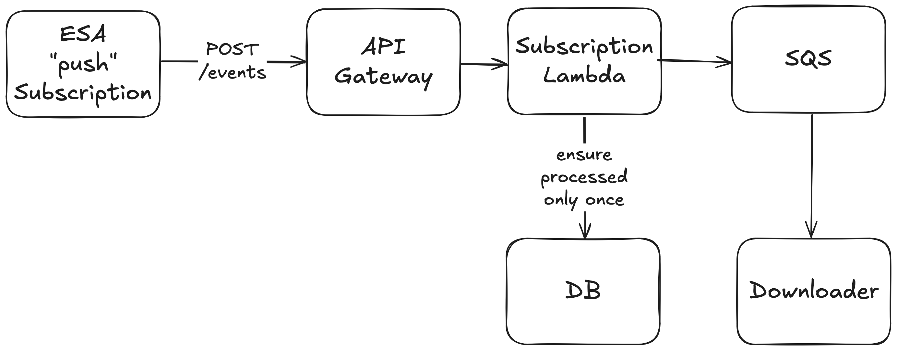

# Link Fetcher 🔗

As of April, 2024 the Copernicus Data Space Ecosystem supports two forms of gathering
links to downloadable Sentinel products,

* Search API ("polling based")
* Subscriptions API ("event based")

We wish to migrate from a polling to an event driven method of link
fetching. During the transition period, this subdirectory handles both
of these methods and deploys them as two separate Lambda functions. This
README describes both forms of link fetching.

## High level overview (Polling)


The Link Fetchers purpose is to query Copernicus Data Space Ecosystem for new imagery links to download. It is invoked within the `Link Fetching` Step Function; every invocation is performed on one day in the form `YYYY-MM-DD`. Images to download are stored as records in the `granule` table, the `granule_count` table is also updated with available and fetched link counts. The `To Download` queue is also populated with the images IDs and download URLs.

## Handler breakdown (Polling)

Provided below is some pseudo-code to explain the process happening each time the lambda is invoked:

```python
available, processed = get_how_many_links_are_available_and_have_been_processed()
query = generate_the_query_for_esa_for_a_day(day)

while there_is_still_imagery_to_process:

    results, total_results = get_a_page_of_query_results(query)
    update_total_results_in_granule_count(total_results)

    if not results:
        there_is_still_imagery_to_process = False
        break

    increase_query_start_point_by_number_of_results(results)

    filtered_results = filter_results_for_only_tiles_we_want(results)

    add_results_to_db_and_sqs_queue(filtered_results)

    update_db_statuses()
```

---

## High level overview (Event Based)



The link subscription handler's purpose is to handle "push" events from Copernicus Data Space Ecosystem's
Subscriptions API for new imagery links to download. It uses API Gateway to provide a publicly accessible endpoint
that triggers the Lambda function. Images to download are stored as records in the `granule` table.
The `To Download` queue is also populated with the images IDs and download URLs.

ESA has provided documentation and an example application for handling the "push" subscriptions,

* https://documentation.dataspace.copernicus.eu/APIs/Subscriptions.html#push-subscriptions
* https://gitlab.cloudferro.com/cat_public/push_subscription_endpoint_example

## Handler breakdown (Event Based)

The "push" subscription endpoint handles "granule created" events that ESA sends to our endpoint.
Each subscription "push" event includes a payload describing one (1) new granule that ESA has
published and made available online to download. The following pseudo-code describes what
the subscription handler Lambda function does each time it is invoked,


```python
if not user_password_correct():
    raise Unauthorized()

new_granule = parse_event_payload()

# bail if newly published granule was acquired too long ago to consider
# (this helps us avoid newly reprocessed images acquired years ago)
if not granule_is_recently_acquired(new_granule):
    return

# bail if newly published granule is not for a tile ID we want to process
if not granule_is_for_desired_mgrs_tile(new_granule):
    return

# record in DB and send to download queue if we've not seen this
# granule ID before (i.e., exactly once processing)
add_results_to_db_and_sqs_queue(filtered_results)
```

---

## Development

This Lambda makes use of `pipenv` for managing dependencies and for building the function when deploying it.

To get setup for developing this project, run:

```bash
$ pipenv install --dev
```

_**Note** if you don't have `PIPENV_NO_INHERIT=TRUE` in your env vars, you will need to prepend the above command with it, to make sure you create a `pipenv` `venv` for just this directory._

This Lambda makes use of the `db` module that will be available via a Lambda Layer once deployed. For local development purposes, it is installed as a editable relative `[dev-packages]` dependency

---

### .env

This Lambda requires a `.env` file in its directory containing the following env vars:

```
PG_PASSWORD="<any-value>"
PG_USER="<any-value>"
PG_DB="<any-value>"
```

This is used whilst running the tests to provide both the Postgres container and the test code the credentials needed to access the database created.

---

### Makefile

A `Makefile` is provided to abstract commonly used commands away:

**`make install`**

> This will run `pipenv install --dev` to install development dependencies

**`make lint`**

> This will perform a dry run of `ruff` and let you know what issues were found

**`make format`**

> This will perform a run of `ruff`, this **will** modify files if issues were found

**`make test`**

> This will run the unit tests of the project with `pytest` using the contents of your `.env` file

---

